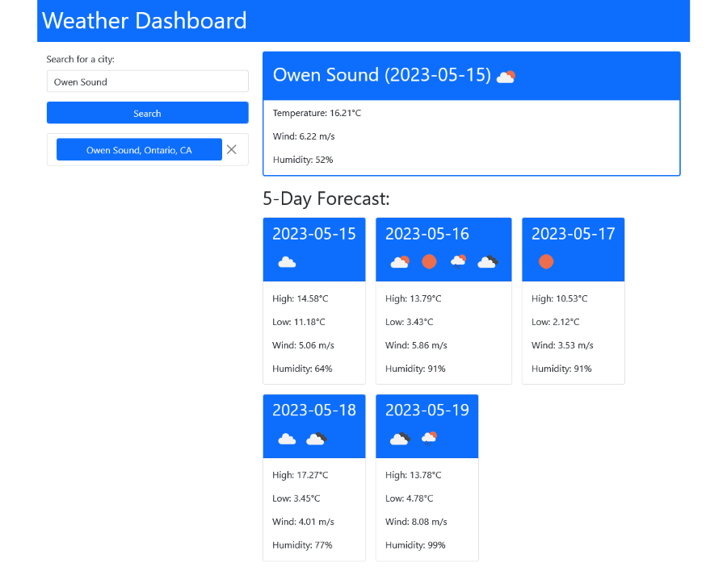

# Weather Dashboard

## Description
This weather dashboard app allows a user to look up weather data for both the current time
and a 5-day forecast.  It also allows stores locations that the user has previously looked
up so that they can get fresh data easily.  I built this app to practice fetching and using
data from a third-party API (the OpenWeatherMap API).  I also incorporated jQuery and Bootstrap
for practice.

## Usage
The user can search for a city by entering its name and optionally a state/province and country
in the text input.  If the search is successful, the city will be added to a history list for
ease of access.  Current weather conditions and a 5-day forecast will be displayed for a city 
after a successful search, or when the user clicks on an item in the history list.  The 
OpenWeatherMap API only updates every 10 minutes, so results are cached in localStorage, and the
app will only request new data after 10 minutes have passed.
[See the weather dashboard live.](https://s2robertson.github.io/weather-dashboard/)

## Credits
The weather dashboard app uses the [OpenWeatherMap API](https://openweathermap.org/).  It also uses
the following libraries:
* [jQuery](https://jquery.com/)
* [Bootstrap](https://getbootstrap.com/)

## License
MIT

## Screenshot
